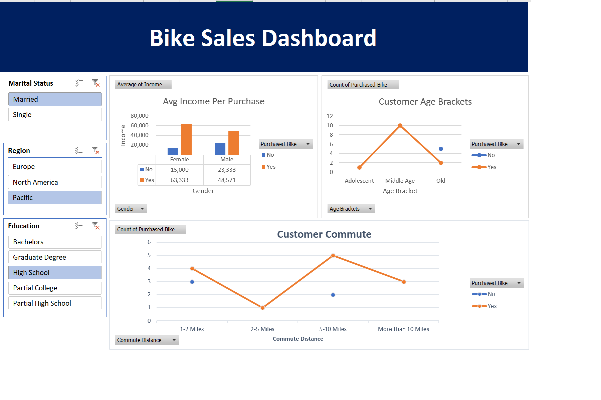

# 🚴‍♂️ Bike Sales Analysis - Excel Project

## 📌 Overview
This project analyzes **bike sales data** to understand purchasing behavior based on **income, commuting distance, and age groups**.  
The analysis includes **pivot tables, charts, and an interactive dashboard** to visualize trends.

## 📂 Dataset
- **File:** [`Bike_Sales_Analysis.xlsx`](./data/Bike_Sales_Analysis.xlsx)
- **Description:** This dataset contains customer information, purchase status, income, commute distance, and age categories.

## 📊 Key Insights
✔ **Higher income customers are more likely to buy a bike.**  
✔ **Middle-aged customers are the most frequent buyers.**  
✔ **Customers with longer commutes tend to purchase bikes.**  

## 📊 Excel Techniques Used
- **Pivot Tables** – Summarized sales by gender, age, and commute distance.
- **Charts & Graphs** – Visualized purchasing trends.
- **Slicers & Filters** – Interactive dashboard elements.
- **Conditional Formatting** – Highlighted key trends.

## 📂 Project Files
- **[`data/Bike_Sales_Analysis.xlsx`](./data/Bike_Sales_Analysis.xlsx)** – Contains raw data, cleaned data, and dashboard.
- **[`reports/Bike_Sales_Dashboard.png`](./reports/Bike_Sales_Dashboard.png)** – Screenshot of the final dashboard.

## 📊 Dashboard Preview

