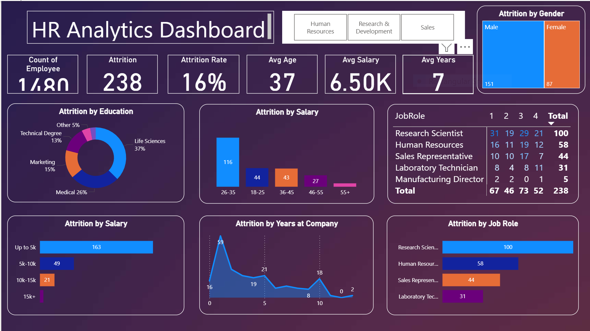

# HR Attrition Dashboard (Power BI)

A Power BI dashboard that breaks employee attrition down by department, role, demographics, and pay, so a stakeholder can see where turnover is actually happening instead of just the headline rate.

**Stack:** Power BI · DAX · data modeling
**Data:** a sample HR dataset of 1,480 employees (demographics, role, compensation, tenure, and an attrition flag)

---

## The question

A single company-wide attrition rate hides the real problem. I built this to answer the next questions: which roles and employee groups lose the most people, and do age, tenure, and pay line up with that?

## What the dashboard shows

- KPI cards: 1,480 employees, 238 who left, a 16% attrition rate, average age 37, average salary ~6.5K, average tenure 7 years
- Attrition broken down by department, job role, education, gender, age, salary band, and years at the company
- A matrix of attrition by job role and performance rating
- A department slicer (HR, R&D, Sales) so every view can be filtered

## What I found

- 238 of 1,480 employees left, a 16% attrition rate
- By count, attrition is highest among Research Scientists (100) and other R&D roles, then Human Resources (58) and Sales Representatives (44)
- It concentrates in the 26-35 age group (116 of the 238 leavers) and in the first year at the company (59 left in year one)
- Lower earners dominate: 163 of the leavers earned up to 5K, far more than any other salary band
- Slightly more men (151) than women (87) left

These point retention effort at early-tenure, younger, lower-paid employees rather than treating attrition as one company-wide number.

## How it is built

- Reusable DAX measures (attrition rate, average age, average salary) instead of hardcoded values, so every visual stays consistent
- A clean star schema, avoiding bidirectional relationships where they aren't needed, to keep filtering predictable and fast
- Measures filtered carefully so groupings like salary bands and attrition counts don't double-count

---

## About me

**Neslihan Oztas Ates** · Data Analyst · Ingolstadt, Germany

[LinkedIn](https://www.linkedin.com/in/neslihanoztas/) · [Portfolio](https://noztas.github.io/Portfolio-Website/) · [GitHub](https://github.com/noztas/) · neslihanoztas1@gmail.com
